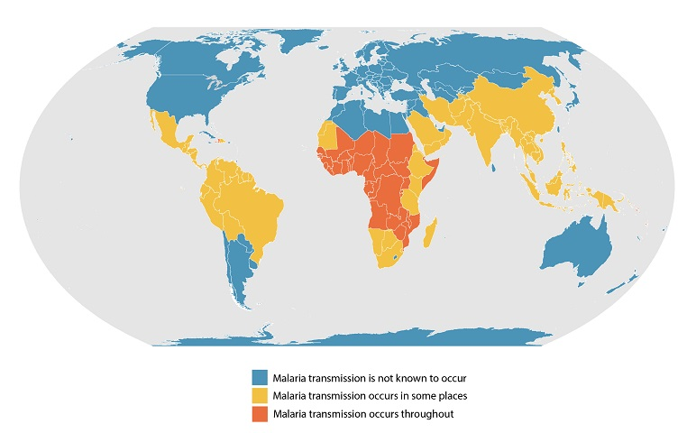
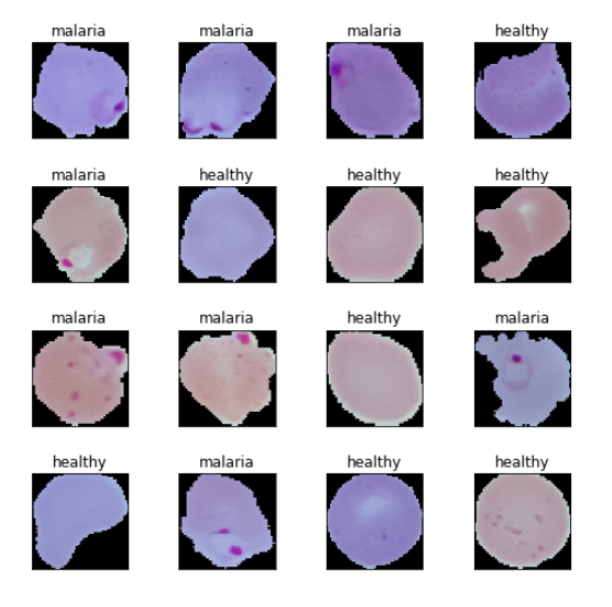
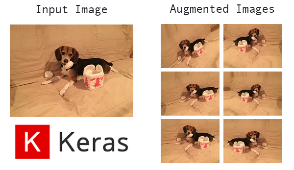

<!-- PROJECT SHIELDS -->

[![LinkedIn][linkedin-shield]][linkedin-url]

<!-- PROJECT LOGO -->
 

  

  <h3 align="center">Malaria Detection</h3>

  

    Using support vector machines and convolutional neural networks to detect parsitized cells
    
  

<!-- TABLE OF CONTENTS -->

  
Table of Contents

  <ol>
    <li>
      <a href="#about-the-project">About The Project</a>
      <ul>
        <li><a href="#built-with">Built With</a></li>
      </ul>
    </li>
    <li>
      <a href="#dataset">Dataset</a>
    </li>
    <li><a href="#image-processing">Image Processing</a></li>
    <li><a href="#data-augmentation">Data Augmentation</a></li>
    <li><a href="#network-architecture">Network Architecture</a></li>
    <li><a href="#results">Results</a></li>
    <li><a href="#summary">Summary</a></li>
    <li><a href="#contact">Contact</a></li>
  </ol>

<!-- ABOUT THE PROJECT -->
## About The Project

Malaria is an infectious disease that are mosquito-borne caused by *Plasmodoium* parasites. There are millions of cases of malaria being reported in many third-world countries. The map below is a heat map of malaria presence in the world thanks to [treated.com](https://www.treated.com/malaria/world-map-risk)(The data is sourced from CDC). We can see that there are a concentration of the disease around tropical regions.

  

According to the CDC(Center of Disease Control and Prevention), malaria symptoms begin about 10 days to 4 weeks after the infection, but it could also show as early as 7 days or as late as 1 year later. After being bitten symptoms could include those similar to a regular flu which is why some people choose to ignore these symptoms. When the parasite enters your blood, it starts to destroy your red blood cells slowly and if not treated in time, it can lead to many complications and in some cases, death. Which is why it is important to detect the parasites early. The World Health Organization indicated that there are over 200 million malaria cases each year and around 400,000 of those cases have been fatal.

The main motivation for this project is to build a model that can easily and effectively diagnose malaria in images of cells. Using the images of blood cells, I want to detect the presence of malaria parasites using support vector machines and convolutional neural networks. 

### Built With

* [Python](https://www.python.org/)
* [TensorFlow 2.3.0](https://www.tensorflow.org/)
* [Keras](https://keras.io/)
* [Scikit-learn](https://scikit-learn.org/stable/)

## Dataset 

The dataset has 27558 images which are placed in two directories according to their classes (13,780 Parasitized and 13,780 Uninfected). Shoutout to the National Institute of Health (NIH) for the dataset. It can be downloaded [here](https://ceb.nlm.nih.gov/proj/malaria/cell_images.zip).
Shown below are some pictures of the cells that are healthy or parasitized:

  

## Image Processing

These images need to be processed in order for the algorithm. Here are the steps that I have taken to process these images:

1. *Original Image(Input)*
2. Image Contouring
3. Image Cropping
4. Image Resizing
5. Image Normalization
6. **Processed Image(Output)**

## Data Augmentation

Keras provides a technique called ImageDataGenerator for data augmentation. This replaces the original batch of data with a new randomly tranformed batches of images. In this case, I rescaled the data by 1/255 with 20% of the data as the validation set to test on. Here is an example of how this technique works:

  

## Network Architecture

coming

## Results

sooon

## Summary

wooohooo
## Contact 

Justin (Jin Wook) Lee  - justinjwlee1114@gmail.com

<!-- MARKDOWN LINKS & IMAGES -->
<!-- https://www.markdownguide.org/basic-syntax/#reference-style-links -->

[linkedin-shield]: https://img.shields.io/badge/-LinkedIn-black.svg?style=for-the-badge&logo=linkedin&colorB=555
[linkedin-url]: https://www.linkedin.com/in/justinjwlee1114/
[product-screenshot]: images/screenshot.png

