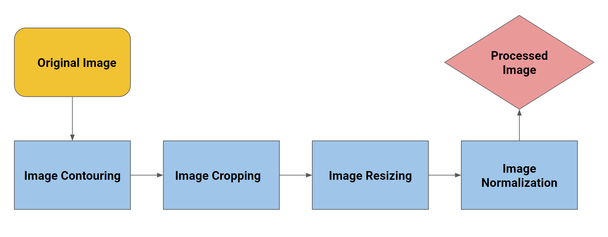

<!-- PROJECT SHIELDS -->

[![LinkedIn][linkedin-shield]][linkedin-url]

<!-- PROJECT LOGO -->
 

  

  <h3 align="center">Malaria Detection</h3>

  

    Using tensorflow/keras and convolutional neural networks to detect parsitized cells
    
  

<!-- TABLE OF CONTENTS -->

  
Table of Contents

  <ol>
    <li>
      <a href="#about-the-project">About The Project</a>
      <ul>
        <li><a href="#built-with">Built With</a></li>
      </ul>
    </li>
    <li>
      <a href="#dataset">Dataset</a>
    </li>
    <li><a href="#image-processing">Image Processing</a></li>
    <li><a href="#data-augmentation">Data Augmentation</a></li>
    <li><a href="#network-architecture">Network Architecture</a></li>
    <li><a href="#results">Results</a></li>
    <li><a href="#summary">Summary</a></li>
    <li><a href="#contact">Contact</a></li>
  </ol>

<!-- ABOUT THE PROJECT -->
## About The Project

  

There are millions of cases of Malaria being reported in many third-world countries. According to the CDC(Center of Disease Control and Prevention), malaria symptoms begin about 10 days to 4 weeks after the infection, but it could also show as early as 7 days or as late as 1 year later. Using the images of blood cells, I want to detect the presence of malaria parasites using random forest and convolutional neural networks.

### Built With

* [Python](https://www.python.org/)
* [TensorFlow 2.3.0](https://www.tensorflow.org/)

## Dataset 

The dataset has 27558 images which are placed in two directories according to their classes (13,780 Parasitized and 13,780 Uninfected).
Shown below are some pictures of the cells that are healthy or parasitized:

  

## Image Processing

  

## Data Augmentation

See the [open issues](https://github.com/othneildrew/Best-README-Template/issues) for a list of proposed features (and known issues).

## Network Architecture

See the [open issues](https://github.com/othneildrew/Best-README-Template/issues) for a list of proposed features (and known issues).

## Results

See the [open issues](https://github.com/othneildrew/Best-README-Template/issues) for a list of proposed features (and known issues).

## Summary

Hello

## Contact 

PLz

<!-- MARKDOWN LINKS & IMAGES -->
<!-- https://www.markdownguide.org/basic-syntax/#reference-style-links -->

[linkedin-shield]: https://img.shields.io/badge/-LinkedIn-black.svg?style=for-the-badge&logo=linkedin&colorB=555
[linkedin-url]: https://www.linkedin.com/in/justinjwlee1114/
[product-screenshot]: images/screenshot.png

