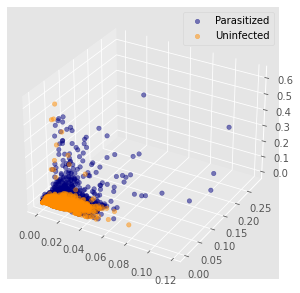
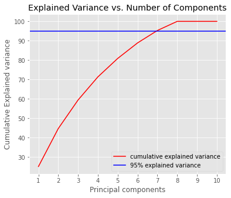

<!-- PROJECT SHIELDS -->

[![LinkedIn][linkedin-shield]][linkedin-url]

<!-- PROJECT LOGO -->
 

  

  <h3 align="center">Malaria Detection</h3>

  

    Using support vector machines and convolutional neural networks to detect parsitized cells
    
  

<!-- TABLE OF CONTENTS -->

  
Table of Contents

  <ol>
    <li>
      <a href="#about-the-project">About The Project</a>
      <ul>
        <li><a href="#built-with">Built With</a></li>
      </ul>
    </li>
    <li>
      <a href="#dataset">Dataset</a>
    </li>
    <li>
      <a href="#support-vector-machine">Support Vector Machine</a>
      <ul>
        <li><a href="#feature-engineering">Feature Engineering</a></li>
      </ul>
      <ul>
        <li><a href="#hyperparameter-tuning-the-svm-model">Hyperparameter Tuning the SVM Model</a></li>
      </ul>
    </li>
    <li>
      <a href="#convolutional-neural-network">Convolutional Neural Network</a>
      <ul>
        <li><a href="#image-processing">Image Processing</a></li>
      </ul>
      <ul>
        <li><a href="#data-augmentation">Data Augmentation</a></li>
      </ul>
      <ul>
        <li><a href="#network-architecture">Network Architecture</a></li>
      </ul>
    <li>
      <a href="#results">Results</a>
      <ul>
        <li><a href="#svm-results">SVM Results</a></li>
      </ul>
      <ul>
        <li><a hred="#cnn-results">CNN Results</a></li>
      </ul>
    </li>
    <li><a href="#summary">Summary</a></li>
    <li><a href="#contact">Contact</a></li>
  </ol>

<!-- ABOUT THE PROJECT -->
## About The Project

Malaria is an infectious disease that are mosquito-borne caused by *Plasmodoium* parasites. There are millions of cases of malaria being reported in many third-world countries. The map below is a heat map of malaria presence in the world thanks to [treated.com](https://www.treated.com/malaria/world-map-risk)(The data is sourced from CDC). We can see that there are a concentration of the disease around tropical regions.

  

According to the CDC(Center of Disease Control and Prevention), malaria symptoms begin about 10 days to 4 weeks after the infection, but it could also show as early as 7 days or as late as 1 year later. After being bitten symptoms could include those similar to a regular flu which is why some people choose to ignore these symptoms. When the parasite enters your blood, it starts to destroy your red blood cells slowly and if not treated in time, it can lead to many complications and in some cases, death. Which is why it is important to detect the parasites early. The World Health Organization indicated that there are over 200 million malaria cases each year and around 400,000 of those cases have been fatal.

The main motivation for this project is to build a model that can easily and effectively diagnose malaria in images of cells. Using the images of blood cells, I want to detect the presence of malaria parasites using support vector machines and convolutional neural networks. 

### Built With

* [Python](https://www.python.org/)
* [TensorFlow 2.3.0](https://www.tensorflow.org/)
* [Keras](https://keras.io/)
* [Scikit-learn](https://scikit-learn.org/stable/)

## Dataset 

The dataset has 27558 images which are placed in two directories according to their classes (13,780 Parasitized and 13,780 Uninfected). Shoutout to the National Institute of Health (NIH) for the dataset. It can be downloaded [here](https://ceb.nlm.nih.gov/proj/malaria/cell_images.zip).
Shown below are some pictures of the cells that are healthy or parasitized:

  

## Support Vector Machine

Although I am confident that convolutional neural networks will outperform this modoel, this will work out well because cnn automatically extracts features and performs a lot of the work under the hood, I want to see if I could build a lighter model that can classify malaria. Also, we do not need the shape or location of the stains(parasite) because it is not needed. 

### Feature Engineering

I will first resize the pictures to 50 x 50 along with adding greyscale. Below are the outputs of some images after applying these parameters. Here is what it looks like:

**Parasitized**

  

**Healthy**

  

After resizing and greyscaling these images, we want to extract our *features* which is going to the distributions of colours. Since the pictures of the cells clearly shows where there are parasites present it will capture this pretty well. I will bin the colours from the range of 0 to 1 into 10 bins. The number zero being black and one being white. Then I normalized the values by dividing the count of the bin by the sum of the counts. 

Lets see how these normalized colour histogram data looks like. Since there are 10-dimensional vectors, we cannot see the whole thing, but I have included the 2D and 3D scatter plot only using the second and third components.

  

  

From this information we can see that we will need to use a non-linear classifier and after some research, it seems that the Radial Basis Function(RBF) kernel will work best because we can tune the gamma and cost(C). More information can be found here on [sckit-learn](https://scikit-learn.org/stable/auto_examples/svm/plot_rbf_parameters.html).

### Hyperparameter Tuning the SVM Model

Now that we know which kernel to use, we can use a grid search to fit multiple models on our training set to find the best value for the gamma and cost. I will be using cross validation and before that I will preprocess the training data to standardize it and tranform it according to its principal components.

To find the best number of components to use, I want it to explain at least 95% of the variance. Here is a graph of the culmulative explained variance against the number of principal components. From the graph below we can see that using the 7th principal component will do just fine.

  

The grid search will use a limit of 7 principal components to find the best gamma and c value. I will be using a range of (0.1,1,10,100) for both gamma and c. 
The best parameters were with the cost value at 100 and gamma at 0.1. This model scored a 83.9% highest mean accuracy. We can now train our model with these hyperparameters with the RBF kernel on the training set and evaluate it on the test set for the final result.

## Convolutional Neural Network

The datatset will be split into train/validation/test with a 0.8/0.1/0.1 split. This picture here describes the structure of my data. 

  

### Image Processing

These images need to be processed in order for the algorithm. Here are the steps that I have taken to process these images:

1. *Original Image(Input)*
2. Image Contouring
3. Image Cropping
4. Image Resizing
5. Image Normalization
6. **Processed Image(Output)**

### Data Augmentation

Keras provides a technique called ImageDataGenerator for data augmentation. This replaces the original batch of data with a new randomly tranformed batches of images. In this case, I rescaled the data by 1/255 with 20% of the data as the validation set to test on. Here is an example of how this technique works:

  

### Network Architecture

The sequential model's structure is as followed: 

| Layer        | Output Shape       | Parameters |
|--------------|--------------------|------------|
| Conv2D       | (None, 62, 62, 16) | 448        |
| MaxPooling2D | (None, 31, 31, 16) | 0          |
| Dropout      | (None, 31, 31, 16) | 0          |
| Conv2D       | (None, 29, 29, 32) | 4,640      |
| MaxPooling2D | (None, 14, 14, 32) | 0          |
| Dropout      | (None, 14, 14, 32) | 0          |
| Flatten      | (None, 6272)       | 0          |
| Dense        | (None, 64)         | 401,472    |
| Dropout      | (None, 64)         | 0          |
| Dense        | (None, 1)          | 65         |

  

There were a total of 406,625 parameters(all trainable and zero non-trainable).

As for the optimizer, after trying out stochastic gradient descent(SGD) and adam with its default learning rate(0.001) and 0.0005, the default adam optimizer performed the best. 

I also added an early stop with a monitor for the validation loss to stop the epochs when needed. The model stopped at 9 epochs giving us a 95.4% accuracy with a 94.6% validation accuracy and 15% loss with 17.7% validation loss. 

  

  

Now we can test this model on our test set to see how it will perform against unseen data. 

## Results

### SVM Results

We started by resizing and grey-scaling the images then created our ten bins. I chose to use a RBF kernel in the SVM model with 7 principal components. After grid searching with cross validation, we found the best value for the gamma and cost. The fully trained model ahieved an accuracy of 84.9% with a precision score of 85.9%. 

### CNN Results 

## Summary

wooohooo
## Contact 

Justin (Jin Wook) Lee  - justinjwlee1114@gmail.com

<!-- MARKDOWN LINKS & IMAGES -->
<!-- https://www.markdownguide.org/basic-syntax/#reference-style-links -->

[linkedin-shield]: https://img.shields.io/badge/-LinkedIn-black.svg?style=for-the-badge&logo=linkedin&colorB=555
[linkedin-url]: https://www.linkedin.com/in/justinjwlee1114/
[product-screenshot]: images/screenshot.png

